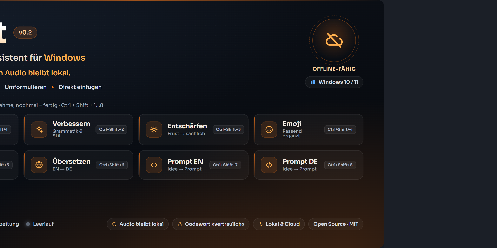
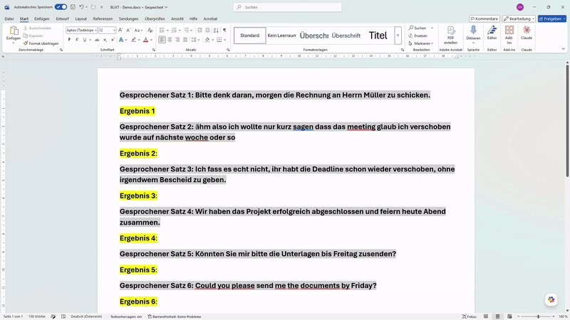

<div align="center">



# Blixt

**Press a hotkey, speak, and the text appears right where your cursor is.**
Windows speech-to-text with smart modes — your audio stays local, the smart step runs in the cloud or fully offline.

[](LICENSE)


</div>

<div align="center">



▶️ **[Watch / download the full demo with sound](https://raw.githubusercontent.com/ChepeKIP70/blixt/main/docs/Blixt-Demo.mp4)** — dictation, smart modes, speak-an-idea-to-Claude, and the offline "pull the plug" moment.

</div>

---

## Table of Contents

- [What is Blixt?](#what-is-blixt)
- [Features](#features)
- [Privacy & smart routing](#privacy--smart-routing)
- [Quick Start](#quick-start)
- [Configuration](#configuration)
- [Offline mode](#offline-mode)
- [Architecture](#architecture)
- [Roadmap](#roadmap)
- [Built with an AI agent](#built-with-an-ai-agent)
- [Credits](#credits)
- [Contributing](#contributing)
- [License](#license)
- [Deutsch 🇩🇪](#blixt-deutsch)

---

## What is Blixt?

Blixt is a small Windows system-tray app for **speech-to-text**: press a hotkey, speak, release — the text is inserted at your cursor automatically. Beyond plain dictation, it offers several **smart modes** (clean-up, calmer rewriting, emojis, translation, prompt-building).

**Your voice never leaves the PC:** transcription always runs **locally** (whisper.cpp). The optional smart-mode step then runs on **Groq** (cloud, fast, high quality) by default — or stays **local** (Ollama) when you're offline or when you prefix your dictation with the codeword **`vertraulich`** (German for "confidential"). Blixt can also run **fully offline** end to end.

Blixt is an independent **Windows** take, derived from the macOS app [blitztext-app](https://github.com/cmagnussen/blitztext-app) (see [Credits](#credits)).

## Features

| Hotkey | Mode | What it does |
|--------|------|--------------|
| `Ctrl+Shift+1` | **Dictate** | Plain transcription, speech → text |
| `Ctrl+Shift+2` | **Improve** | Tidy up spelling, grammar, flow |
| `Ctrl+Shift+3` | **Vent** | Turn an angry rant into a calm, clear message |
| `Ctrl+Shift+4` | **Emoji** | Add fitting emojis to your text |
| `Ctrl+Shift+5` | **Translate DE→EN** | Speak German → get English text |
| `Ctrl+Shift+6` | **Translate EN→DE** | Speak English → get German text |
| `Ctrl+Shift+7` | **Prompt (EN)** | Speak a rough idea → a structured AI prompt in English |
| `Ctrl+Shift+8` | **Prompt (DE)** | Same, output in German |

Toggle recording: press once to start, press again to finish. The result lands on the clipboard and is auto-pasted at the cursor.

The **Prompt** modes produce a 7-field prompt (Role · Objective · Context · Task · Constraints · Output format · Recap), following current prompt-engineering guidance from Anthropic, OpenAI and Google.

## Privacy & smart routing

Blixt is **private by default for your audio**:

- **Transcription always runs locally** (whisper.cpp) — the audio never leaves your PC.
- The **smart-mode text step** (Improve, Vent, Emoji, Translate, Prompt) goes to **Groq** by default — *if* you're online and a Groq API key is set — for speed and better quality.
- Prefix your dictation with the codeword **`vertraulich`** to force that step **local** too (Ollama). The codeword is stripped from the result.
- No internet or no key? Blixt **falls back to local automatically** — no error, no interruption.

The status window shows which route was used: **☁ Groq** or **🔒 Local**.

## Quick Start

**Prerequisites:** [Rust](https://rustup.rs) (MSVC toolchain), [Node.js](https://nodejs.org), and WebView2 (pre-installed on Windows 11).

```powershell
cd app
npm install
npx tauri icon src-tauri/icons/icon-source.png   # generate the icon set (once)
npm run build -- --no-bundle                      # portable .exe
```

The binary is created at `app/src-tauri/target/release/blixt.exe`.

### First run

Launch `blixt.exe`. **No window opens — Blixt lives in the system tray** (the orange microphone icon, bottom-right; it may be hidden behind the `^` arrow). Left-click it for the status window, right-click for Settings / Quit.

### Setup

Blixt always transcribes **locally**, so the local whisper server needs to be running (one-time setup, ~15 min): **[docs/OFFLINE-SETUP.md](docs/OFFLINE-SETUP.md)**.

For the **smart modes** (everything beyond plain dictation) pick one:

- **Fastest / best quality:** grab a free [Groq](https://console.groq.com/keys) API key, paste it in tray → **Settings**. The text step then runs on Groq whenever you're online.
- **Fully offline:** run [Ollama](https://ollama.com) with a local model (e.g. `qwen2.5:7b`) — no key, no internet.

Then click into any text field, press **`Ctrl+Shift+1`**, speak, and press it again — your text appears at the cursor. Prefix **`vertraulich`** anytime to keep everything local.

## Configuration

Open the tray icon → **Settings**. API keys are stored in the **Windows Credential Manager**, never in the code.

- **Transcription:** always local via the whisper.cpp server. Set its URL (default `http://127.0.0.1:8765/v1`).
- **Smart-mode text model:** runs on **Groq** when you're online and a key is set; otherwise it falls back to local **Ollama**. The codeword `vertraulich` always forces local.

## Offline mode

Blixt can run **completely offline** using local servers:

- **Transcription** → a local [whisper.cpp](https://github.com/ggml-org/whisper.cpp) server (GPU via CUDA/Vulkan, or CPU) — this is always used
- **Text model** → [Ollama](https://ollama.com) running a local model (e.g. `qwen2.5:7b`) — used when offline, without a Groq key, or via the `vertraulich` codeword

This is **not turnkey** — you install and run those local servers yourself. Step-by-step instructions: **[docs/OFFLINE-SETUP.md](docs/OFFLINE-SETUP.md)**.

## Architecture

A thin Tauri 2 app (Rust core + WebView2 UI). Rust modules under `app/src-tauri/src/`:

| Module | Responsibility |
|--------|----------------|
| `main.rs` | Tray, global hotkeys, orchestration, privacy routing |
| `modes.rs` | The 8 modes (labels, hotkeys, system prompts, temperatures), codeword detection |
| `provider.rs` | Provider layer — OpenAI-compatible transcription + chat (Groq / OpenAI / local) |
| `audio.rs` | Microphone capture (`cpal`) → WAV (`hound`) |
| `paste.rs` | Auto-paste at the cursor (`enigo` + Win32 focus restore) |
| `settings.rs` | Settings + API keys (Windows Credential Manager) |

The provider layer is the key idea: Groq, OpenAI and the local servers all speak the same OpenAI-compatible API, so switching between cloud and offline is just a base URL.

## Roadmap

- ✅ 8 modes, auto-paste, local transcription + cloud/offline smart step
- ✅ Privacy routing (`vertraulich` codeword, audio always local)
- ⏳ One-step offline setup (bundled local servers)
- ⏳ User-configurable hotkeys, codeword & hold-to-talk mode
- ⏳ Signed release builds + installer
- ⏳ More target languages for translate

## Built with an AI agent

Blixt was built by someone who is **not a Rust developer**, working with an AI coding agent — from analysing the original macOS app, to a working, offline-capable native Windows port. It is an honest demonstration of how far AI-assisted development can take a real native application. The code is human-reviewed and runs; it is intentionally small and hackable, not a polished commercial product.

## Credits

Based on [**blitztext-app**](https://github.com/cmagnussen/blitztext-app) by **cmagnussen** (MIT License). Blixt is an independent re-implementation for Windows (Tauri/Rust), not a code fork — with its **own name, icon and branding** as required by the original project's trademark notice.

The system-tray microphone glyph is from [**Material Design Icons**](https://pictogrammers.com/library/mdi/) (Apache License 2.0), recoloured in the Blixt orange.

**What's different from the original:** Windows instead of macOS, a swappable provider layer (Groq/OpenAI/local) instead of OpenAI-only, always-local transcription with codeword privacy routing, a fully offline mode, and extra modes (Translate DE→EN and EN→DE, Prompt EN/DE).

## Contributing

Small, hackable, PRs welcome — see [CONTRIBUTING.md](CONTRIBUTING.md).

## License

[MIT](LICENSE).

<br>

---
---

<br>

<div align="center">

# Blixt (Deutsch)

**Taste drücken, sprechen — der Text erscheint direkt am Cursor.**
Windows-Sprache-zu-Text mit cleveren Modi — dein Audio bleibt lokal, der clevere Schritt läuft in der Cloud oder komplett offline.

</div>

## Was ist Blixt?

Blixt ist eine kleine Windows-App (im System-Tray, also dem Symbolbereich unten rechts) für **Sprache-zu-Text**: Taste drücken, sprechen, loslassen — der Text wird automatisch am Cursor eingefügt. Neben reinem Diktat gibt es mehrere **clevere Modi** (Aufpolieren, Entschärfen, Emojis, Übersetzen, Prompt-Bauen).

**Deine Stimme verlässt den PC nie:** Die Transkription läuft immer **lokal** (whisper.cpp). Der optionale clevere Schritt läuft standardmäßig über **Groq** (Cloud, schnell, hohe Qualität) — oder bleibt **lokal** (Ollama), wenn du offline bist oder dem Diktat das Codewort **`vertraulich`** voranstellst. Blixt läuft auf Wunsch auch **komplett offline**.

Blixt ist eine eigenständige **Windows**-Variante, abgeleitet aus der macOS-App [blitztext-app](https://github.com/cmagnussen/blitztext-app) (siehe [Credits](#credits-1)).

## Funktionen

| Hotkey | Modus | Funktion |
|--------|-------|----------|
| `Ctrl+Shift+1` | **Diktat** | Reine Transkription, Sprache → Text |
| `Ctrl+Shift+2` | **Verbessern** | Rechtschreibung, Grammatik, Lesefluss |
| `Ctrl+Shift+3` | **Entschärfen** | Wütendes Reden → ruhige, klare Nachricht |
| `Ctrl+Shift+4` | **Emoji** | Passende Emojis in den Text |
| `Ctrl+Shift+5` | **Übersetzen DE→EN** | Deutsch sprechen → englischer Text |
| `Ctrl+Shift+6` | **Übersetzen EN→DE** | Englisch sprechen → deutscher Text |
| `Ctrl+Shift+7` | **Prompt (EN)** | Grobe Idee sprechen → strukturierter KI-Prompt auf Englisch |
| `Ctrl+Shift+8` | **Prompt (DE)** | Dasselbe, Ausgabe auf Deutsch |

Toggle-Aufnahme: einmal drücken = Start, nochmal drücken = fertig. Das Ergebnis landet in der Zwischenablage und wird am Cursor eingefügt.

Die **Prompt**-Modi erzeugen einen 7-Felder-Prompt (Rolle · Ziel · Kontext · Aufgabe · Randbedingungen · Ausgabeformat · Kurzfassung), nach aktuellen Prompt-Engineering-Empfehlungen von Anthropic, OpenAI und Google.

## Datenschutz & cleveres Routing

Blixt ist **für dein Audio standardmäßig privat**:

- **Die Transkription läuft immer lokal** (whisper.cpp) — das Audio verlässt den PC nie.
- Der **clevere Text-Schritt** (Verbessern, Entschärfen, Emoji, Übersetzen, Prompt) geht standardmäßig an **Groq** — *sofern* du online bist und ein Groq-API-Schlüssel hinterlegt ist — für Tempo und bessere Qualität.
- Stell dem Diktat das Codewort **`vertraulich`** voran, dann bleibt auch dieser Schritt **lokal** (Ollama). Das Codewort wird aus dem Ergebnis entfernt.
- Kein Internet oder kein Schlüssel? Blixt **fällt automatisch auf lokal zurück** — kein Fehler, kein Abbruch.

Das Statusfenster zeigt den genutzten Weg: **☁ Groq** oder **🔒 Lokal**.

## Schnellstart

**Voraussetzungen:** [Rust](https://rustup.rs) (MSVC-Toolchain), [Node.js](https://nodejs.org), WebView2 (auf Windows 11 vorinstalliert).

```powershell
cd app
npm install
npx tauri icon src-tauri/icons/icon-source.png   # Icon-Set einmalig erzeugen
npm run build -- --no-bundle                      # portable .exe
```

Ergebnis: `app/src-tauri/target/release/blixt.exe`.

### Erster Start

`blixt.exe` starten. **Es öffnet sich kein Fenster — Blixt lebt im System-Tray** (oranges Mikrofon-Symbol unten rechts, evtl. hinter dem `^`-Pfeil versteckt). Linksklick zeigt das Statusfenster, Rechtsklick öffnet Einstellungen / Beenden.

### Einrichtung

Blixt transkribiert immer **lokal**, daher muss der lokale whisper-Server laufen (einmalige Einrichtung, ~15 Min): **[docs/OFFLINE-SETUP.md](docs/OFFLINE-SETUP.md)**.

Für die **cleveren Modi** (alles außer reinem Diktat) wählst du eines:

- **Am schnellsten / beste Qualität:** kostenlosen [Groq](https://console.groq.com/keys)-API-Schlüssel holen, im Tray → **Einstellungen** einfügen. Der Text-Schritt läuft dann über Groq, sobald du online bist.
- **Komplett offline:** [Ollama](https://ollama.com) mit lokalem Modell (z.B. `qwen2.5:7b`) — kein Schlüssel, kein Internet.

Dann in ein beliebiges Textfeld klicken, **`Strg+Umschalt+1`** drücken, sprechen, nochmal drücken — der Text erscheint am Cursor. Stell jederzeit **`vertraulich`** voran, um alles lokal zu halten.

## Konfiguration

Tray-Symbol → **Einstellungen**. API-Schlüssel liegen im **Windows Credential Manager**, nie im Code.

- **Transkription:** immer lokal über den whisper.cpp-Server. Server-URL eintragen (Standard `http://127.0.0.1:8765/v1`).
- **Clever-Modi-Textmodell:** läuft über **Groq**, wenn du online bist und ein Schlüssel hinterlegt ist; sonst Rückfall auf lokales **Ollama**. Das Codewort `vertraulich` erzwingt immer lokal.

## Offline-Modus

Blixt läuft **komplett offline** über lokale Server:

- **Transkription** → lokaler [whisper.cpp](https://github.com/ggml-org/whisper.cpp)-Server (GPU via CUDA/Vulkan oder CPU) — wird immer genutzt
- **Textmodell** → [Ollama](https://ollama.com) mit lokalem Modell (z.B. `qwen2.5:7b`) — genutzt offline, ohne Groq-Schlüssel oder per Codewort `vertraulich`

Das ist **nicht turnkey** — die lokalen Server richtest du selbst ein. Schritt für Schritt: **[docs/OFFLINE-SETUP.md](docs/OFFLINE-SETUP.md)**.

## Architektur

Schlanke Tauri-2-App (Rust-Kern + WebView2-Oberfläche). Rust-Module unter `app/src-tauri/src/`:

| Modul | Aufgabe |
|-------|---------|
| `main.rs` | Tray, globale Hotkeys, Ablaufsteuerung, Datenschutz-Routing |
| `modes.rs` | Die 8 Modi (Bezeichnung, Hotkey, System-Prompt, Temperatur), Codewort-Erkennung |
| `provider.rs` | Anbieter-Schicht — OpenAI-kompatible Transkription + Chat (Groq / OpenAI / lokal) |
| `audio.rs` | Mikrofon (`cpal`) → WAV (`hound`) |
| `paste.rs` | Auto-Einfügen am Cursor (`enigo` + Win32-Fokus-Wiederherstellung) |
| `settings.rs` | Einstellungen + API-Schlüssel (Windows Credential Manager) |

Kernidee ist die Anbieter-Schicht: Groq, OpenAI und die lokalen Server sprechen dieselbe OpenAI-kompatible Schnittstelle — der Wechsel Cloud ↔ offline ist nur eine andere Basis-URL.

## Roadmap

- ✅ 8 Modi, Auto-Einfügen, lokale Transkription + Cloud/Offline-Clever-Schritt
- ✅ Datenschutz-Routing (Codewort `vertraulich`, Audio immer lokal)
- ⏳ Ein-Schritt-Offline-Setup (gebündelte lokale Server)
- ⏳ Frei konfigurierbare Hotkeys, Codewort & Halten-zum-Sprechen
- ⏳ Signierte Release-Builds + Installer
- ⏳ Mehr Zielsprachen beim Übersetzen

## Mit einem KI-Agenten gebaut

Blixt entstand — von jemandem, der **kein Rust-Entwickler** ist, zusammen mit einem KI-Coding-Agenten: von der Analyse der Original-macOS-App bis zu einem lauffähigen, offline-fähigen nativen Windows-Port. Es ist eine ehrliche Demonstration, wie weit KI-gestützte Entwicklung eine echte native Anwendung tragen kann. Der Code ist menschlich geprüft und läuft; er ist bewusst klein und hackbar, kein poliertes Kommerzprodukt.

## Credits

Basiert auf [**blitztext-app**](https://github.com/cmagnussen/blitztext-app) von **cmagnussen** (MIT-Lizenz). Blixt ist eine eigenständige Neu-Implementierung für Windows (Tauri/Rust), **kein** Code-Fork — mit **eigenem Namen, Icon und Branding**, wie es der Marken-Hinweis des Originals verlangt.

Die Mikrofon-Glyphe im System-Tray stammt von [**Material Design Icons**](https://pictogrammers.com/library/mdi/) (Apache-Lizenz 2.0), in Blixt-Orange eingefärbt.

**Was anders ist:** Windows statt macOS, austauschbare Anbieter-Schicht (Groq/OpenAI/lokal) statt nur OpenAI, immer lokale Transkription mit Codewort-Datenschutz-Routing, ein komplett offline-Modus, und zusätzliche Modi (Übersetzen DE→EN und EN→DE, Prompt EN/DE).

## Mitwirken

Klein, hackbar, PRs willkommen — siehe [CONTRIBUTING.md](CONTRIBUTING.md).

## Lizenz

[MIT](LICENSE).
